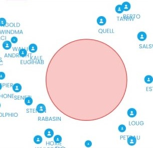

# Crisis Crowd Simulation
*Un acercamiento a la simulación de multitudes en situaciones de pánico*

- [Crisis Crowd Simulation](#crisis-crowd-simulation)
  - [Resumen](#resumen)
  - [Introducción](#introducción)
  - [Modelación](#modelación)
    - [Ambiente](#ambiente)
    - [Agentes](#agentes)
    - [SFM](#sfm)
    - [Sistema de rutas](#sistema-de-rutas)
    - [Búsqueda de zonas vulnerables](#búsqueda-de-zonas-vulnerables)
  - [Implementación](#implementación)
    - [Software](#software)
    - [Estructura del Backend](#estructura-del-backend)
    - [Agentes](#agentes-1)
      - [Generación de variables aleatorias](#generación-de-variables-aleatorias)
    - [Rutas](#rutas)
    - [Generación de nombres](#generación-de-nombres)
    - [Búsqueda de zonas vulnerables](#búsqueda-de-zonas-vulnerables-1)
  - [Resultados](#resultados)
    - [Miedo de la zona de peligro](#miedo-de-la-zona-de-peligro)
    - [Sesgo](#sesgo)
    - [Imposición de sus objetivos](#imposición-de-sus-objetivos)
    - [Cuellos de botella](#cuellos-de-botella)
    - [Huida con éxito](#huida-con-éxito)
    - [Vulnerabilidades encontradas en zonas estrechas](#vulnerabilidades-encontradas-en-zonas-estrechas)
    - [Nombres aleatorios](#nombres-aleatorios)
  - [Referencias](#referencias)

## Resumen
Este proyecto presenta una solución capaz de encontrar vulnerabilidades en el diseño de un edificio que impidan una correcta evacuación de personas en una situación de peligro o zonas sensibles en las que la ocurrencia de uno de estos hechos afectaría su evacuación enormemente. Para esto se implementa una simulación de masas enfocada en agentes y utilizando el modelo de fuerzas sociales para representar las fuerzas físicas y psicológicas que influyen en cada persona junto a una estimación de zonas vulnerables a través de una optimización con una estrategia evolutiva.

## Introducción
Los trabajos relacionados a la simulación de multitudes analizados mostraron un uso mayoritario de dos enfoques, basada en agentes y multi-agentes, aunque algunos trabajos se centran en otras estrategias como la lógica difusa $^{[1]}$. El uso de enfoque multi-agente es más común en simulaciones a gran escala ( grandes escenarios y miles de personas) $^{[2-4]}$, teniendo como objetivo analizar espacios interiores de un edificios o secciones de este no se vio necesario usar este enfoque y se optó por modelos orientados a agentes como los trabajos de Dirk Helbing $^{[5-7]}$, quien propone el SFM ( *Social Forces Model* o Modelo de fuerzas sociales). Este modelo ha sido además comparado con otros $^{[8]}$ teniendo muy buenos resultados.

## Modelación
Según el problema se puede caracterizar los componentes principales de la simulación. Los agentes, en este caso serían únicamente las personas presentes en el espacio a simular, estos son reactivos a su ambiente constituido por los obstáculos en este espacio, la zona de peligro y las zonas seguras.
### Ambiente
En el ambiente que se encuentran los agentes de la simulación se modelan cuerpos físicos donde la posición y forma son los datos fundamentales almacenado. Esto incluye a los agentes y los obstáculos presentes así como zonas seguras o de destino a la que aspiran llegar. El ambiente puede clasificarse como:
+ **Inaccesible**: Los agentes pueden no tener conocimiento de toda la estructura del edificio en el que se encuentran. Además, según observaciones al comportamiento de las personas en estas situaciones de pánico $^{[6-7][9]}$ estas se obsesionan con objetivos a corto plazo y tienen grandes sesgos en su criterio de cual es la mejor forma de lograr su objetivo, escapar, dejando así en segundo plano en muchas ocasiones, vías de escape que pudieran ser más cortas. Este posible desconocimiento es simplificado en el presente proyecto mediante la decisión de una zona segura como objetivo a la que ir para cada agente, independiente a su cercanía, se asume que esta es la zona que el agente *conoce*.
+ **No determinista**: Por supuesto, los aspectos psicológicos y propios de cada persona juegan un papel fundamental en este escenario. En eventos reales pueden ocurrir eventos extraordinarios resultado de la iniciativa y voluntad de las personas los cuales son imposible a tener en cuenta. Este comportamiento es simplificado a través del modelo de fuerzas sociales, el cual se explica más adelante.
+ **Dinámico**: Con la explosión de una bomba se afecta la estructura de un edificio y puede haber daños que se manifiesten después de transcurrido un tiempo; en un incendio el fuego se va expandiendo por las zonas donde se encuentran las condiciones propicias para este fenómeno. Las zonas de peligro tienden a expandirse y los obstáculos en el escape de las personas se complejizan. Como el interés de este proyecto se centra en el diseño del espacio simulado no existe la necesidad de simular tal comportamiento y por tanto se simplifica a través de una única zona de peligro que mantiene obstaculizada una zona de manera estática. De la misma forma se considera que las zonas seguras no de alteran. Mediante estas restricciones el ambiente modelado pasa a ser **estático**.
+ **Continuo**: Los agentes se mantienen en movimiento y las fuerzas sobre estos se mantienen en todo instante, por tanto, en cualquier instante de tiempo las posiciones de los agentes pueden ser distintas a sus posiciones en otro instante cualquiera. Para simplificar la simulación discretizamos el estado de la simulación a través de iteraciones, calculando este cada un período de tiempo fijo.
### Agentes
Los agentes en esta simulación son únicamente las personas dentro del espacio de esta, y la única acción modelada es su movimiento, estos presentan una serie de características principales:
+ **Son reactivos**: Su movimiento se ve afectado por la presencia de obstáculos, por el radio de acción del incidente ocurrido y por la presencia de otros agentes, por tanto deben tener la capacidad de reaccionar alejándose de estos de forma realista.
+ **Son proactivos y de razonamiento práctico**: Su meta es llegar a una zona segura para escapar el peligro y tienen en mente una dirección a la que moverse para conseguirlo, son insistentes y egoístas, este ha sido el comportamiento demostrado en observaciones de este tipo de eventos. $^{[6-7][9]}$

### SFM

El modelo base utilizado para definir el comportamiento de los agentes es, como se decía anteriormente, el *modelo de fuerzas sociales*, un modelo de fuerzas generalizado propuesto por Helbing desde $1995$ $^{[10]}$, y que en $2002$ $^{[7]}$ propone describir el movimiento de las personas dentro de una multitud como una interacción entre fuerzas, en este caso, teniendo en cuenta las fuerzas físicas ( resultantes de la colisión con un obstáculo o agente) y fuerzas sociales como la repulsión hacia los obstáculos y el peligro de la zona del incidente ocurrido al iniciar la simulación.

Con base a la simulación realizada por él y pares en el $2002$ se describe la aceleración del movimiento de una persona de manera similar, con la fórmula:

$$m_i\frac{dv_i}{dt}=m_i\frac{v_{i_0} ( t)e_{i_0} ( t)-v_i ( t)}{\delta_i}+\sum_{j\neq i}\mathit{f}_{i,j}+\sum_{W}\mathit{f}_{W_i}+\mathit{f}_{D_i} $$
Donde:
- $m_i$: Peso de cada persona en kilogramos.
- $v_{i_0}$: La velocidad a la que cada persona desea moverse.
- $e_{i_0}$: La dirección en la que cada persona desea moverse.
- $v_{i}$: La velocidad actual a la que cada persona se desplaza.
- $\delta_i$: El tiempo durante el cual la persona cambia su velocidad.
- $\mathit{f}_{i,j}$, $\mathit{f}_{W_i}$ y $\mathit{f}_{D_i}$: Son las fuerzas que hacen que la persona se mantenga a determinada distancia de otros agentes, obstáculos y el área de peligro respectivamente

El cambio en la posición de cada persona $i$ ( $p_i ( t)$) entonces se da por la velocidad $v_i ( t)=\frac{dp_i}{dt}$.

La fuerza que ejerce una persona $j$ sobre una persona $i$ se define como una suma de una fuerza de repulsión más la fuerza de ambos cuerpos colisionando si se encuentran suficientemente cerca a través de la siguiente fórmula:

$$\mathit{f}_{i,j}=A_i\exp ( \frac{r_{i,j}-d_{i,j}}{B_i})n_{i,j}+
k\Theta ( r_{i,j}-d_{i,j})n_{i,j}$$

Donde:
- $A_i$ y $B_i$: Ambas constantes que reflejan la intensidad de la fuerza de repulsión y la significación de la distancia entre ambas personas para esta.
- $r_{i,j}$: La suma de los radios entre ambas personas.
- $d_{i,j}$: La distancia a la que se encuentran ambas personas.
- $n_{i,j}$: El vector normalizado que apunta de la persona $j$ a la
persona $i$.
- $k$: Constante para la intensidad de la fuerza física que separa a dos personas en contacto.
- $\Theta (x)$: Es una función cuyo valor es cero si ambas personas no están en contacto ( $d_{i,j}>r_{i,j}$), su valor será $x $ en caso contrario.

De forma similar se define la fuerza sobre los obstáculos:

$$\mathit{f}_{W_i}=A_i\exp ( \frac{r_{i}-d_{W_i}}{B_i})n_{W_i}+
k\Theta ( r_{i}-d_{W_i})n_{W_i}$$

En este caso los valores en lugar de ser en función de cada persona $i$ y cada persona son en función de $i$ y los obstáculos del espacio de la simulación.

De igual forma a los obstáculos se define $\mathit{f}_{D_i}$ con la única diferencia de que está tiene sus propias constantes $A$ y $B$ para la fuerza de repulsión (que llamaremos $A_D$ y $B_D$) para permitir dar menor peso a la distancia con respecto a la zona de peligro en la fuerza de repulsión.

### Sistema de rutas

Para definir la dirección en la que las personas se desean mover esta debe corresponder a la dirección en la que estos deben moverse para cumplir sus objetivos, es decir, llegar a una zona segura. Esta dirección se calculará a través de la búsqueda de una ruta desde la posición inicial de esa persona hasta la zona segura a la que decide escapar. En cada iteración de la simulación la dirección en la que el agente debe moverse estará guiada por la ruta establecida por este.

### Búsqueda de zonas vulnerables

Con zonas vulnerables nos referimos a zonas en las que si ocurriera un incidente afectaría enormemente la evacuación y salvamento de las personas dentro de la zona simulada. Determinar cuales pueden ser estas zonas es un objetivo del proyecto.

## Implementación

### Software
La simulación funciona a modo de servicio web, a través de una RESTful API implementada sobre el lenguaje Python con FastAPI como framework para la construcción de esta. ( El esquema de la API según el estándar openapi 3.0.2 está [adjunto](./openapi.json))

Para la visualización de la simulación se creó una aplicación web, un frontend, utilizando React como framework.

### Estructura del Backend
El backend gestiona el mapa utilizado en la simulación y además el *contexto* de esta. Este contexto se basa en una clase que es la encargada de almacenar los datos de la simulación, inicializar y actualizar el estado de esta con cada iteración.

Los datos sobre el mapa: los obstáculos, las zonas seguras y la zona de peligro son brindados por el frontend a través de la API y utilizados para la inicialización del contexto. Estos elementos del terreno se representan a través de rectángulos o círculos.

Al iniciar una simulación el context se encarga de añadir personas de manera aleatoria y envía a través de un endpoint especial los datos de esta al frontend.

El intervalo entre cada iteración de la simulación es de $\frac{1}{8}$ segundos; suficientemente pequeño para que no ocurran errores de colisiones y suficientemente grande para poder ejecutar la simulación a una velocidad razonable en el hardware disponible.

Para la estimación de zonas vulnerables existen endpoints especiales, y solo se consideran los obstáculos y zonas seguras. A través de endpoints especiales se van enviando las ubicaciones encontradas como más vulnerables en cada paso de la búsqueda durante un límite de tiempo de $20$ minutos o hasta $25$ iteraciones.

### Agentes
La información propia de un agente se encuentra encapsulada en la clase `simulation.agents.Pedestrian`, junto a los métodos para calcular las fuerzas que influyen sobre él y su cambio de posición.

Para el cálculo de fuerzas se utilizaron los valores de las constantes propuestas en por Helbing $^{[7]}$ en el caso de las fuerzas con otras personas y obstáculos.
+ $A_i$ y $B_i$: Se definen constante para cada persona con un valor de $3\times 10^3$ y $0.08 $ respectivamente.
+ $k$: $1,2\times 10^5$
+ Para la velocidad de las personas se tomaron algunos de los resultados de las observaciones en su investigación y se determinó una velocidad deseada de $1\frac{m}{s}$ y una velocidad máxima de $3\frac{m}{s}$.

Para las zonas de peligro se incorporó una mecánica adicional que hace que la sensación de peligro y por tanto la repulsión causada por las bombas vaya disminuyendo con el tiempo. El valor de la fuerza entonces es:

$$\mathit{f}_{D_i}=\frac{A_D}{\beta}\exp ( \frac{r_{i}-d_{D_i}}{B_D})n_{D_i}+
k\Theta ( r_{i}-d_{D_i})n_{D_i}$$

Donde $\beta$ es la cantidad de segundos que han transcurrido en la simulación y después de varios análisis se determinó que un valores correctos para $B_D$ sería $6$ mientras que el valor de $A_D$ podía mantener el mismo valor que $A_i$.

#### Generación de variables aleatorias

Durante la inicialización de la simulación se crean $n$ personas según es decidido al empezar y se distribuyen estas de manera independiente en el espacio libre del mapa. Se conoce que los peatones independientes en un mismo lugar distribuyen de forma uniforme sobre este $^{[6]}$. 

Se define además el radio de cada uno para el cual se toma el mismo definido en la simulación de Helbing que es una distribución uniforme entre $0.25$ m y $0.35$ m $^{[7]}$. 

Se genera también el peso de las personas, para esto se consideran que todos son adultos entre los $18$ y $65$ años de edad. En estas edades el peso es una variable aleatoria de distribución lognormal y sus parámetros fueron tomados del censo NHANES IV citado por Kenneth Portier en $2007$ $^{[11]}$.

### Rutas
Para definir las rutas de los agentes se debía buscar el camino más corto hacia la zona segura a la que estos deciden ir. Para solucionar este problema clásico de navegación se utiliza el algoritmo de búsqueda A* sobre puntos de una *navmesh*. Esta navmesh es construida a partir de el espacio libre de obstáculos del terreno, se reduce este espacio en el radio máximo de una persona ( $0.35$ m ) y se triangula utilizando celdas de Voronoi y triangulación de Delaunay. Este proceso es realizado para transformar el espacio de búsqueda a un espacio discreto, permitiendo solo definir rutas a través de los vértices de los triángulos resultado de la triangulación o de los centroides de estos.

En la búsqueda de la ruta se utiliza como heurística la norma del vector $\alpha= ( o_i-c_i)$ siendo $o_i$ el punto destino y $c_i$ el punto actual, es decir, la distancia en línea recta sin considerar obstáculos. Esta heurística es admisible ya que en caso de que hubiera obstáculos obligatoriamente la persona necesitaría desviarse de la ruta haciéndola más larga y en caso de no haber obstáculo entonces la persona puede ir en línea recta a su destino, siendo exactamente el mismo valor. La heurística es además consistente por desigualdad triangular.

La optimalidad está por tanto asegurada en el espacio reducido sobre el que se aplica el A*.

Como los agente intentan recorrer la misma ruta en todo momento y se modela el ambiente de forma estática se puede solamente calcular la ruta de cada persona una única vez al inicio de la simulación. 

La dificultad en este caso es que los agentes pueden desviarse de esta ruta debido a la presencia de otros agente en la misma que ejercerían fuerzas sobre ellos o debido a la fuerza resultante del temor al incidente que los hace alejarse de la zona de peligro. En estos casos si una persona intentara en todo momento reincorporarse al siguiente punto de la ruta podría estar haciendo un recorrido antinatural y más largo que si siguiera recto hacia un punto más cerca del destino. Para solucionar eso además se busca en cada iteración el punto más cercano al destino que forme parte de la ruta al cual el agente puede llegar en linea recta y se toma este como su nuevo punto de destino.

### Generación de nombres

Con el objetivo de identificar el recorrido de personas específicas en una simulación se incorporó información de un *ID* para cada persona el cual se mostraría en pantalla. Este ID entonces antes que un número se decidió que fuera un nombre ( más memorable y fácil de distinguir para un humano) y para la generación de este nombre se utilizó una estrategia basada en *Modelos Ocultos de Markov*.

El modelo utilizado define cada uno de sus estados como los caracteres de la cadena y una único valor observable que es la letra que se encuentra en esa posición. Para el entrenamiento de este modelo se utilizó una lista de cerca de $21$ $500$ nombres de orígenes diversos.

Con esta representación de estados y probabilidad los nombres generados se encontraban muy alejados de un nombre común y por el peso que tienen las consonantes en el abecedario estás se repetían sin sentido una detrás de la otra. Para solucionar este defecto en la generación se utilizó un parámetro que variaba lo que el modelo consideraba un estado entonces se comenzó a considerar un estado como las últimas $n$ letras de la palabra, siendo la $n$-ésima la emitida por ese estado. Entonces a medida que el valor de $n$ dado aumentaba los nombres se asimilaban más a otros conocidos pero a su vez eran menos creativos y más repetitivos en las combinaciones. De determinó que $n=3$ era un valor suficientemente equilibrado para este parámetro.

### Búsqueda de zonas vulnerables
Para esta tarea se debía realizar una optimización de la *vulnerabilidad* de la posición de una zona de peligro. Para esta tarea se decidió implementar un motor de algoritmos genéticos parametrizado para buscar estas zonas y establecer parámetros que dieran cabida a máximos locales que quizás fuera de interés tenerlos en cuenta.

El algoritmo genético tendría una población inicial de una única solución. En cada generación se escogerían:
+ Una cantidad de entre las mejores soluciones de forma que al juntarles y realizar *crossover* dos a dos se obtuviera un máximo de $C$ constante nuevas soluciones donde el crossover sería el punto medio entre ambas soluciones.
+ Una cantidad $M$ contante de mutaciones aleatoriamente de toda la población (permitiendo repetirse la misma solución).
+ Una cantidad $I$ constante de soluciones que por ser las $I$ mejores de esta generación se mantendrán en la siguiente.
Para la siguiente generación se generan las nuevas soluciones haciendo crossover de la forma antes mencionadas y las mutaciones desplazando cada solución escogida en una dirección aleatoria una distancia proporcional a su *fitness*.

La función objetivo a optimizar y por tanto el *fitness* de cada solución está dado por una heurística de cuan *buena/mala* es la posición de una zona de peligro para la evacuación de las personas. Intuitivamente una zona afecta más si se encuentra en un lugar por el que obligatoriamente tienen que pasar mucha gente para escapar, de forma que o bloquea el paso completamente o al menos está lo suficientemente cerca para afectar el movimiento de las personas al forzarlos a alejarse de su ruta original.

Teniendo esto en cuenta se propone la heurística dada por *el promedio de la distancia a la zona de peligro de cada una de las rutas calculadas para las personas en la simulación*. En lugar de ejecutar toda la simulación y comprobar resultados se realiza por cada solución propuesta solo el cálculo inicial de la navmesh, la generación de personas en el espacio simulado y el cálculo de las rutas de esta. Luego, si una persona tiene una ruta que lo fuerza a pasar cerca de la zona de peligro entonces su escapé se afectará enormemente. Si la zona bloquea cualquier ruta posible de una persona se considera que la distancia es $0$. De esta forma se tiene una función objetivo medianamente continua.

Después de varias pruebas se encontraron valores $C$,$M$,$I$ para los cuales el algoritmo se comporta de una forma aceptable. El crossover en la mayoría de los casos imposibilitó *la exploración* y hacia que se centrara más el algoritmo en la explotación entonces, se eliminó este con $C=0$, luego se establecieron los valores $M=7$ y $I=5$. Haciendo un total de $12$ soluciones en cada generación.

## Resultados
Luego de varias ejecuciones se comprobó que se lograron simular comportamientos de estas situaciones con éxito.

### Miedo de la zona de peligro
La diferencia de parámetros en el cálculo de fuerza de repulsión de una persona con respecto a la zona de peligro permite que aún lejos la persona se incline a alejarse en dirección opuesta, huyendo primeramente del peligro sin inicialmente pensar en escapar por la ruta que desea.

  

    
     
    Estado inicial de la simulación.
  

  

    
     
    3 segundos luego del inicio de la simulación.
  

### Sesgo
Las personas se centran en una zona segura (la que conocen) en algunos casos omitiendo rutas de escape más cortas.

  

    
    
     
    En estas imágenes se evidencia un flujo de personas de un lado a otro en la zona central que no ocurriría si se tomara la zona segura más cercana o una sola preferida por persona.
  

 
 

### Imposición de sus objetivos
Durante la huida las personas priorizan sus objetivos egoístas entrando en conflicto con otros causando que las personas se empujen unas a otras.

  

    

      
      
      
    

  

   
  En estas imágenes a los 0.25, 11 y 40.25 segundos de la simulación respectivamente se puede apreciar a una persona (resaltada en naranja) que por su tamaño es desplazada por otras que intentan tomar la misma ruta.

 
 

### Cuellos de botella
Durante la simulación en espacios estrechos se forman cuellos de botella donde las personas de mayor peso y tamaño se imponen y empujan a otros para pasar como se ha demostrado en imágenes anteriores

### Huida con éxito
Después de un tiempo luchando contra otros y huyendo de la bomba se puede observar que cada persona que no se encuentra atrapada puede llegar a la zona segura y por tanto el cálculo de ruta funciona correctamente.

### Vulnerabilidades encontradas en zonas estrechas
Las regiones donde ocurre el fenómeno antes mencionado son detectadas durante la búsqueda de zonas vulnerables sin necesidad de llevar a cabo toda la simulación.

  

    
     
    Iteración no. 1 de la metaheurística.
  

  

    
     
    Iteración no. 3 de la metaheurística.
  

  

    
     
    Iteración no. 4 de la metaheurística.
  

  

    
     
    Iteración no. 8 de la metaheurística.
  

 
 

En la figura anterior se muestra cómo se encuentra una solución hacia el centro que abandona el bloqueo total de algunas rutas por una mayor dificultad en el acceso de otras.

### Nombres aleatorios
Se comprobó la utilidad de los modelos ocultos de Markov en la generación de nombres, aunque raros ha demostrado ser una estrategia útil para la esta tarea. Algunos de los nombres de 6 letras generados han sido:

|||||
|-|-|-|-|
reisia | melbon | lairea | lynert
koosel | survas | pedrai | lettat
venisl | jacias | bakerr | muslie
durwoo | rosenn | rufsky | alphil
birchl | primbl | uthway | therti
putney | ahreri | cartan | obazar
daglav | huahfs | hoytsh | hilipp
elland | benebe | kohnst | rineti
caline | clayne | haynet | haniev
lazard | darich | lighof | thiaso
taamal | lomash | bronet | janiya
nallso | roxand | schlut | cyness
vossel | fredic | michyo | cleter
nennan | ahlsto | weight | luelan
efrodd | frumas | yimaha | breats
kobind | lareed | sussey | burgwa

## Referencias
1.  Dell’Orco, M., Marinelli, M., Ottomanelli, M.: Simulation of crowd dynamics in panic situations using a fuzzy logic-based behavioural model. In: Computer-based Modelling and Optimization in Transportation. pp. 237–250. Springer (2014).
2. Almeida, J.E., Rosseti, R.J., Coelho, A.L.: Crowd simulation modeling applied to emergency and evacuation simulations using multi-agent systems. arXiv preprint arXiv:1303.4692. (2013).
3. Moulin, B., Chaker, W., Perron, J., Pelletier, P., Hogan, J., Gbei, E.: MAGS Project: Multi-agent GeoSimulation and Crowd Simulation. In: Kuhn, W., Worboys, M.F., and Timpf, S. (eds.) Spatial Information Theory. Foundations of Geographic Information Science. pp. 151–168. Springer, Berlin, Heidelberg (2003). [https://doi.org/10.1007/978-3-540-39923-0_11](https://doi.org/10.1007/978-3-540-39923-0_11).
4.  Malinowski, A., Czarnul, P., Czuryƚo, K., Maciejewski, M., Skowron, P.: Multi-agent large-scale parallel crowd simulation. Procedia Computer Science. 108, 917–926 (2017). [https://doi.org/10.1016/j.procs.2017.05.036](https://doi.org/10.1016/j.procs.2017.05.036).
5.  Helbing, D., Molnár, P., Farkas, I.J., Bolay, K.: Self-Organizing Pedestrian Movement. Environ Plann B Plann Des. 28, 361–383 (2001). [https://doi.org/10.1068/b2697](https://doi.org/10.1068/b2697).
6.  Helbing, D., Farkas, I.J., Molnar, P., Vicsek, T.: Simulation of pedestrian crowds in normal and evacuation situations. Pedestrian and evacuation dynamics. 21, 21–58 (2002).
7. Helbing, D., Farkas, I.J., Vicsek, T.: Crowd Disasters and Simulation of Panic Situations. In: Bunde, A., Kropp, J., and Schellnhuber, H.J. (eds.) The Science of Disasters: Climate Disruptions, Heart Attacks, and Market Crashes. pp. 330–350. Springer, Berlin, Heidelberg (2002).
8. Guy, S.J., Van Den Berg, J., Liu, W., Lau, R., Lin, M.C., Manocha, D.: A statistical similarity measure for aggregate crowd dynamics. ACM Transactions on Graphics (TOG). 31, 1–11 (2012).
9.  Moussaïd, M., Helbing, D., Theraulaz, G.: How simple rules determine pedestrian behavior and crowd disasters. Proceedings of the National Academy of Sciences. 108, 6884–6888 (2011). [https://doi.org/10.1073/pnas.1016507108](https://doi.org/10.1073/pnas.1016507108).
10. Helbing, D.: Social force model for pedestrian dynamics. Phys. Rev. E. 51, 4282–4286 (1995). [https://doi.org/10.1103/PhysRevE.51.4282](https://doi.org/10.1103/PhysRevE.51.4282).
11. Portier, K., Tolson, J.K., Roberts, S.M.: Body weight distributions for risk assessment. Risk Anal. 27, 11–26 (2007). [https://doi.org/10.1111/j.1539-6924.2006.00856.x](https://doi.org/10.1111/j.1539-6924.2006.00856.x).
